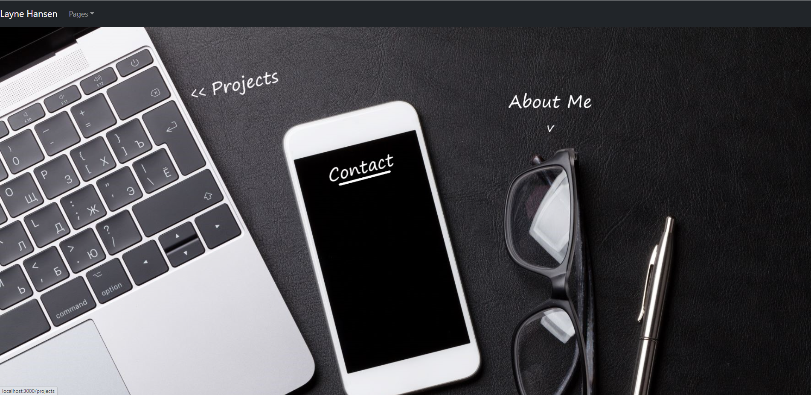
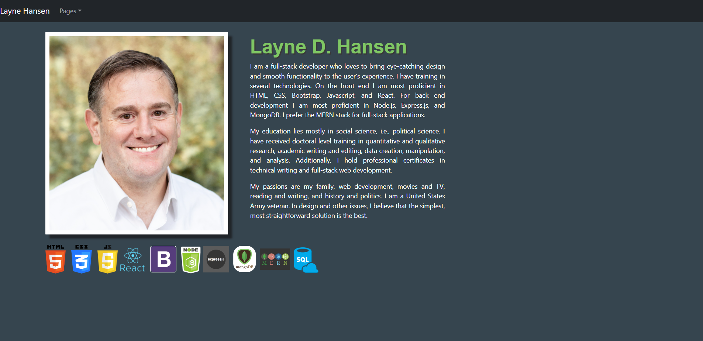
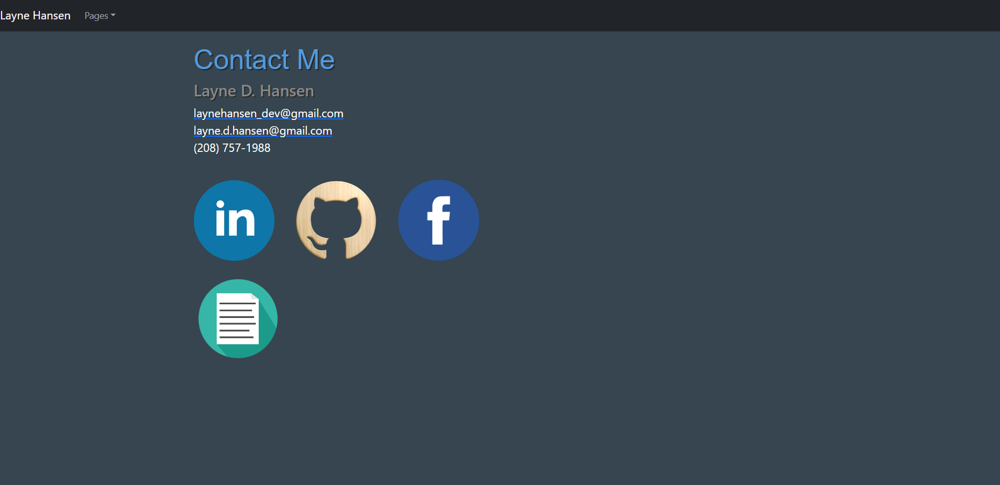
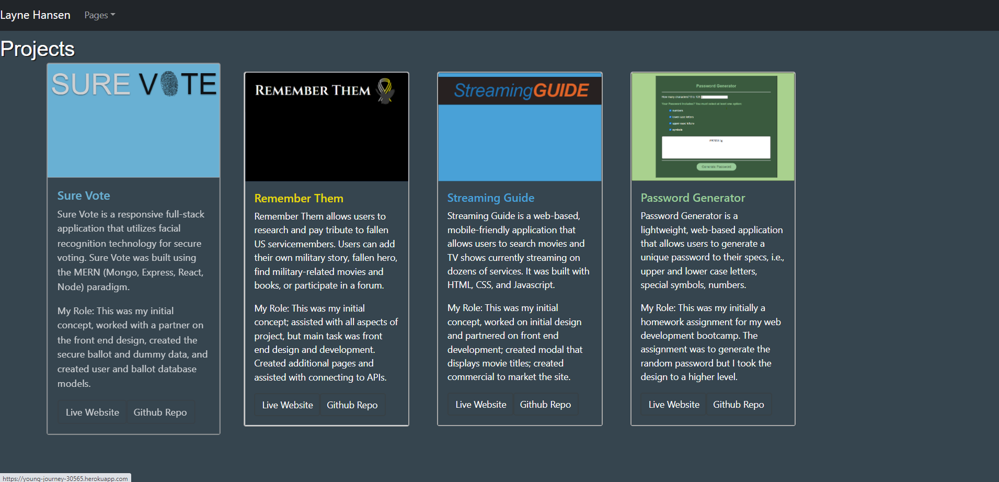

# LayneHansen.github.io#

### Table of Contents

[Purpose](https://github.com/LayneHansen/LayneHansen.github.io#purpose) 
[Components](https://github.com/LayneHansen/LayneHansen.github.io#components) 
- [Main Page](https://github.com/LayneHansen/LayneHansen.github.io#main-page) 
- [Profile](https://github.com/LayneHansen/LayneHansen.github.io#profile) 
- [Contact](https://github.com/LayneHansen/LayneHansen.github.io#contact) 
- [Portfolio](https://github.com/LayneHansen/LayneHansen.github.io#projects) 

[What I've Learned](https://github.com/LayneHansen/LayneHansen.github.io#what-ive-learned) 

## **Purpose**

The purpose of this page is to display myself and my work as a web developer. This network of pages includes the main landing page, profile, contact page, and projects. I have created this new version of my portfolio using React, React Router, and React Bootstrap.

----

### **Main Page**

On the main page I utilize the html map feature to create clickable fields to take the user to different pages. I like a clean look to my pages and want the user to be clear about where they want to go. Although the images are clickable and lead to the different landing pages, I have included a dropdown menu that also allows them to navigate to those pages.

#### ***link*** 
https://laynehansen.github.io/

#### ***screenshot*** 

### **Profile**

The profile page provides basic information about me and my interests. It includes a thoughtful/trustworthy looking picture of yours truly.

#### ***link*** 
https://laynehansen.github.io/profile

#### ***screenshot***

### **Contact** 

I used icons as links to my Github profile, LinkedIn, and I created a Facebook page for my web development. The latter will mostly be used to network my future freelance/contract endeavors, but I created it to create a larger network for the work I want to do.

#### ***link***
https://laynehansen.github.io/contact

#### ***screenshot***

### **Projects**

I have created several projects, but have included only these few. Outside of a private project I am working on, I consider these four to be my best work. At the bottom I have created links to the live sites, my github repositories for the given projects, and included information about the projects and my specifice roles in bringing them to life.

#### ***link***
https://laynehansen.github.io/projects

#### ***screenshot***

----

## **What I've Learned**

I've only been in this industry for two years and that included my six-month bootcamp. I love web development and desire to do it full-time. In my current position, I work mostly with back and development and data architecture.

----

## License

#### MDN License
Copyright (c) [2020] [Layne Hansen]
----
July 22, 2020.